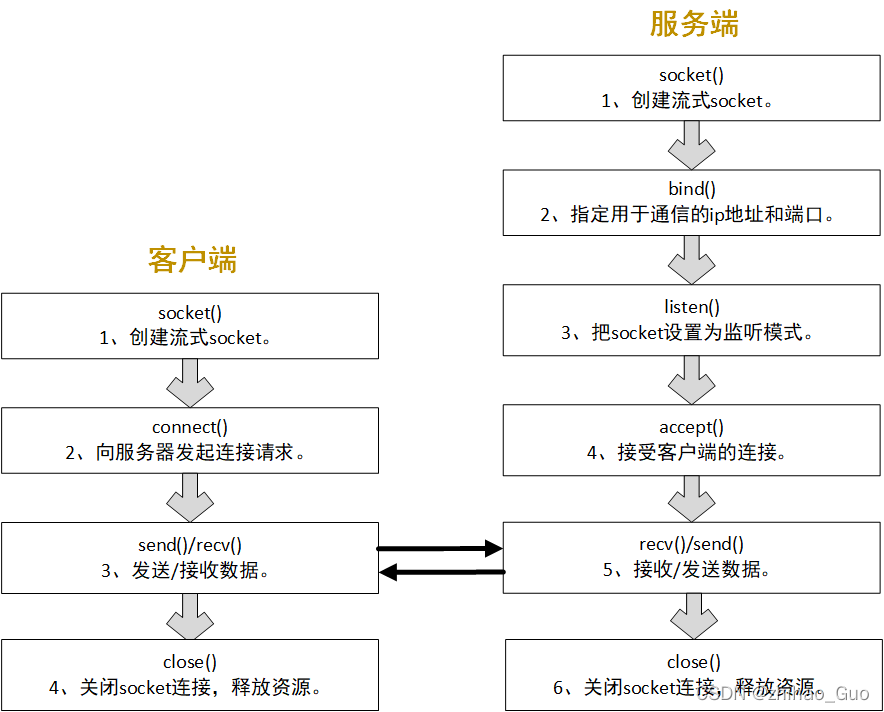

首先介绍网络编程的流程
____
    计算机是通过TCP/IP协议进行互联从而进行通信的，为了把复杂的TCP/IP协议隐藏起来，
    更方便的实现计算机中两个程序进行通信，引出了socket这个概念。
    下面是socket的流程图

    C++网络编程常用API

客户端网络通信过程与常用API
________
客户端的工作流程socket() -> connect() -> send()/recv() -> close()：

    1、创建套接字：int socket(int family,int type,int protocol);
    功能介绍：在Linux系统中，一切皆文件。为了表示和区分已经打开的文件，UNIX/Linux会给
    文件分配一个ID，这个ID就是一个整数，被称为文件描述符。因此，网络连接也是一个文件，
    它也有文件描述符。通过socket()函数来创建一个网络连接或者说打开一个网络文件，
    socket()函数的返回值就是文件描述符，通过这个文件描述符我们就可以使用普通的文件操作
    来传输数据了，就如同打开txt文件一样。
    参数介绍：
    第一个参数：IP地址类型，AF_INET表示使用IPv4，如果使用IPv6请使用AF_INET6。
    第二个参数：数据传输方式，SOCK_STREAM表示流格式、面向连接，多用于TCP。SOCK_DGRAM表示数据报格式、无连接，多用于UDP。
    第三个参数：协议，0表示根据前面的两个参数自动推导协议类型。设置为IPPROTO_TCP和IPPTOTO_UDP，分别表示TCP和UDP

    2、客户端请求连接函数： int connect(int sock_fd, struct sockaddr *serv_addr,int addrlen);
    功能介绍：客户端向服务端发起连接请求，当返回值是0时代表连接成功，返回值为-1时代表连接失败。
    参数介绍：
    参数一：sock_fd代表通过socket()函数返回的文件描述符
    参数二：serv_addr 代表目标服务器的协议族，网络地址以及端口号。是一个sockaddr 类型的指针。
    参数三：addrlen 代表第二个参数内容的大小。

    3、int send(int sockfd,const void *buf,int len,int flags)
    功能介绍：send函数用于把数据通过socket发送给对端。不论是客户端还是服务端，应用程序都用send函数
    来向TCP连接的另一端发送数据。客户端通过该函数向服务器应用程序发送数据。函数返回已发送的字节数。出错时返回-1
    参数介绍：
    参数一：sockfd代表 发送端的套接字描述符，即通过socket()函数返回的文件描述符。
    参数二：buf 指明需要发送数据的内存地址，可以是C语言基本数据类型变量的地址，也可以是数组、结构体、字符串。
    参数三： len 指明实际发送数据的字节数。
    参数四：flags 一般设置为0，其他数值意义不大。

    4、 int recv(int sockfd,void *buf,int len,int flags);
    功能介绍：recv函数用于接收对端socket发送过来的数据。不论是客户端还是服务端，应用程序都用recv函数
    接受来自TCP连接的另一端发送过来的数据。如果socket对端没有发送数据，recv函数就会等待，如果对端发送
    了数据，函数返回接收到的字符数。出错时返回-1。如果socket被对端关闭，返回值为0。
    参数介绍：
    参数一：sockfd代表接收端的套接字描述符，即通过socket()函数返回的文件描述符。
    参数二：buf 为用于接收数据的内存地址，可以是C语言基本数据类型变量的地址，也可以是数组、结构体、字符串。只要是一块内存就行了。
    参数三：len 指明需要接收数据的字节数。不能超过buf的大小，否则内存溢出。
    参数四：flags填0，其他数值意义不大

    4、 int close(int sockfd)
    函数功能：关闭套接字，并终止TCP连接。若成功则返回0.失败则返回-1；
    函数参数：
    参数一：sockfd代表接收端的套接字描述符，即通过socket()函数返回的文件描述符。

服务端的工作流程：socket() -> bind() -> listen() -> accept() -> recv()/send() -> close()
___________

    1、套接字绑定函数 int bind(int sockfd, const struct sockaddr *addr, socklen_t addrlen);
    函数功能：服务端把用于通信的地址和端口绑定到socket上，当bind函数返回0时，为正确绑定，返回-1，则为绑定失败。
    参数介绍：
    参数一：sockfd 代表需要绑定的socket。是在创建socket套接字时返回的文件描述符。
    参数二：addr 存放了服务端用于通信的地址和端口
    参数三：addrlen 代表addr结构体的大小

    2、监听函数 int listen(int sockfd, int backlog);
    函数功能：listen函数的功能并不是等待一个新的connect的到来，真正等待connect的是accept函数。
    isten的操作就是当有较多的client发起connect时，server端不能及时的处理已经建立的连接，
    这时就会将connect连接放在等待队列中缓存起来。这个等待队列的长度有listen中的backlog参数来设定。
    当listen运行成功时，返回0；运行失败时，返回值为-1.
    参数说明：
    参数一：sockfd是前面socket创建的文件描述符;
    参数二：backlog是指server端可以缓存连接的最大个数，也就是等待队列的长度。

    3、int accept(int sockfd,struct sockaddr *client_addr,socklen_t *addrlen);
    函数功能：accept函数等待客户端的连接，如果没有客户端连上来，它就一直等待，这种方式称为阻塞。
    accept等待到客户端的连接后，创建一个新的socket，函数返回值就是这个新的socket，服务端用于这个新的socket和客户端进行报文的收发。
    参数介绍：
    参数一：sockfd 是已经被listen过的socket。
    参数二：client_addr 用于存放客户端的地址信息，其中包含客户端的协议族，网络地址以及端口号。如果不需要客户端的地址，可以填0。
    参数三：addrlen 用于存放参数二(client_addr)的长度
