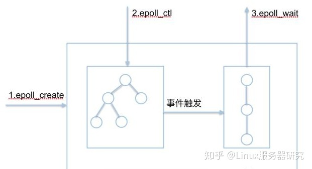

高并发还得用epoll
_____
[Epoll模型详解](http://blog.chinaunix.net/uid-28541347-id-4232252.html)   讲的很清楚 
Epoll概述 
    epoll是一种I/O事件通知机制，是linux 内核实现IO多路复用的一个实现。
    IO多路复用是指，在一个操作里同时监听多个输入输出源，在其中一个或多个输入输出源可用的时候返回，然后对其的进行读写操作。
    I/O多路复用：epoll就是一种典型的I/O多路复用技术: epoll技术的最大特点是支持高并发。
    epoll的通俗解释是一种当文件描述符的内核缓冲区非空的时候，发出可读信号进行通知，当写缓冲区不满的时候，发出可写信号通知的机制
    
    epoll的核心是3个API，核心数据结构是：1个红黑树和1个链表

Epoll函数介绍 
____
        epoll_create(); 
        epoll_ctl(); 
        epoll_wait(); 
        epoll_event_callback(); 
      
1. int epoll_create(int size)

    功能：内核会产生一个epoll 实例数据结构并返回一个文件描述符，这个特殊的描述符就是epoll实例的句柄，后面的两个接口都以它为中心（即epfd形参）。
    size参数表示所要监视文件描述符的最大值，不过在后来的Linux版本中已经被弃用（同时，size不要传0，会报invalid argument错误）

2. int epoll_ctl(int epfd， int op， int fd， struct epoll_event *event)

    功能：将被监听的描述符添加到红黑树或从红黑树中删除或者对监听事件进行修改

    typedef union epoll_data {
    void *ptr; /* 指向用户自定义数据 */
    int fd; /* 注册的文件描述符 */
    uint32_t u32; /* 32-bit integer */
    uint64_t u64; /* 64-bit integer */
    } epoll_data_t;

    struct epoll_event {
    uint32_t events; /* 描述epoll事件 */
    epoll_data_t data; /* 见上面的结构体 */
    };
      对于需要监视的文件描述符集合，epoll_ctl对红黑树进行管理，红黑树中每个成员由描述符值和所要监控的文件描述符指向的文件表项的引用等组成。

    op参数说明操作类型：

    EPOLL_CTL_ADD：向interest list添加一个需要监视的描述符

    EPOLL_CTL_DEL：从interest list中删除一个描述符

    EPOLL_CTL_MOD：修改interest list中一个描述符

    struct epoll_event结构描述一个文件描述符的epoll行为。在使用epoll_wait函数返回处于ready状态的描述符列表时，

    data域是唯一能给出描述符信息的字段，所以在调用epoll_ctl加入一个需要检测的描述符时，一定要在此域写入描述符相关信息

    events域是bit mask，描述一组epoll事件，在epoll_ctl调用中解释为：描述符所期望的epoll事件，可多选。

    常用的epoll事件描述如下：

    EPOLLIN：描述符处于可读状态

    EPOLLOUT：描述符处于可写状态

    EPOLLET：将epoll event通知模式设置成edge triggered

    EPOLLONESHOT：第一次进行通知，之后不再监测

    EPOLLHUP：本端描述符产生一个挂断事件，默认监测事件

    EPOLLRDHUP：对端描述符产生一个挂断事件

    EPOLLPRI：由带外数据触发

    EPOLLERR：描述符产生错误时触发，默认检测事件

3. int epoll_wait(int epfd， struct epoll_event *events， int maxevents， int timeout)

    功能：阻塞等待注册的事件发生，返回事件的数目，并将触发的事件写入events数组中。

    events: 用来记录被触发的events，其大小应该和maxevents一致

    maxevents: 返回的events的最大个数

    处于ready状态的那些文件描述符会被复制进ready list中，epoll_wait用于向用户进程返回ready list。events和maxevents两个参数描述一个由用户分配的struct epoll event数组，调用返回时，内核将ready list复制到这个数组中，并将实际复制的个数作为返回值。注意，如果ready list比maxevents长，则只能复制前maxevents个成员；反之，则能够完全复制ready list。

    另外，struct epoll event结构中的events域在这里的解释是：在被监测的文件描述符上实际发生的事件。

    参数timeout描述在函数调用中阻塞时间上限，单位是ms：

    timeout = -1表示调用将一直阻塞，直到有文件描述符进入ready状态或者捕获到信号才返回；

    timeout = 0用于非阻塞检测是否有描述符处于ready状态，不管结果怎么样，调用都立即返回；

    timeout > 0表示调用将最多持续timeout时间，如果期间有检测对象变为ready状态或者捕获到信号则返回，否则直到超时。
